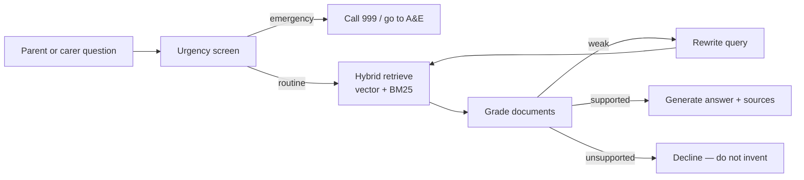

# PedIR-Bot

**Public CIRSE demo of an agentic RAG assistant for paediatric interventional radiology patient and carer education.**

[](https://pedirbot-demo.streamlit.app)
[](https://www.cirse.org/)

> Educational prototype. Not a medical device. Not consent, not triage, and not after-hours medical advice.

CIRSE 2026 oral (SPHAIRE): *Beyond Information Leaflets: Development of an Interactive AI Chatbot for Patient and Carer Education in Paediatric Interventional Radiology* (Lee, Lam, Fung, Kan; Hong Kong Children’s Hospital / Kwong Wah Hospital).

This repository is the **public, Streamlit-ready slice** of that work: the retrieval–generation design and a small original leaflet pack. It does **not** contain crawled hospital or society corpora.

---

## For interventional radiologists

Parents still arrive with fasting errors, PICC anxiety, and after-hours questions that a static leaflet does not answer in the language they used. A general chatbot is the wrong fix: it will invent an NPO time, quote another hospital’s policy, or talk past an emergency.

PedIR-Bot treats answering as a **workflow**, not a prompt:

1. **Urgency screen** — emergency language is redirected to 999 / A&E (or your local equivalent), not answered from the model’s memory.
2. **Hybrid retrieve** — semantic search plus BM25 keyword search, so “tube in the arm” can still find PICC.
3. **Grade and rewrite** — if the retrieved paragraph is weak, the agent rewrites the query and searches again instead of improvising.
4. **Generate from sources** — the answer is grounded in the retrieved leaflets, with citations the tester can open.

Local hospital instructions are intended to outrank society leaflets when both are present. CIRSE and other public materials remain useful **supplements**. They do not replace the host-hospital sheet.

A radiologist-review node exists in the graph for a future clinical audit step. It is **not enabled** in this public demo and should not be described as live production governance.



### What this public demo contains

| Included | Not included |
| --- | --- |
| LangGraph agentic RAG (retrieve → grade → rewrite → generate) | Crawled HKCH / HKSIR / CIRSE / SickKids corpora |
| Four original educational leaflets (`demo_kb/`) | Hospital site-logistics or identifiable patient material |
| Streamlit Cloud chat UI | Full evaluation workbooks |
| Open-weight chat via OpenRouter free endpoints | A claim that the live app is clinically validated |

The study evaluation used a larger, institution-first corpus that stays in a private research repository. Here you can inspect the **architecture** and try the **same control graph** on a tiny public pack (what paediatric IR is, PICC, fasting, embolization aftercare).

### Pilot evaluation (official raw scores)

Two interventional radiologists (6 and 16 years of IR experience) independently scored **150** caregiver questions across six domains (preparation, recovery, complications, medicines, admission, disease education) on accuracy and relevance (1–6) and completeness (1–3).

The bake-off compared a **fully hosted** frontier model (Gemini 3 Flash) with a **locally hostable** medical SLM (MedGemma 1.5) on the same agentic RAG stack.

| Dimension | Gemini 3 Flash | MedGemma 1.5 |
| --- | ---: | ---: |
| Accuracy (1–6) | 5.07 | 3.95 |
| Relevance (1–6) | 5.10 | 4.17 |
| Completeness (1–3) | 2.22 | 1.77 |

Overall differences: Wilcoxon signed-rank, *p* < .001. English relevance and completeness were comparable; Cantonese favoured Gemini on all three metrics. This is a **deployment-feasibility pilot**, not a parent-outcome study. Expert review still matters.

---

## Try the live demo

**App (after you connect Streamlit Cloud once):** [https://pedirbot-demo.streamlit.app](https://pedirbot-demo.streamlit.app)

[Deploy this repo](https://share.streamlit.io/deploy?repository=willlee1995/pedirbot-demo&branch=main&mainModule=streamlit_app.py) while signed in to Streamlit with GitHub, then paste secrets from [`.streamlit/secrets.toml.example`](.streamlit/secrets.toml.example). Name the app `pedirbot-demo` so the public URL matches the badge above.

Example questions the public leaflets can support:

- What is paediatric interventional radiology?
- Why might a child need a PICC line?
- What should families know about fasting before an IR procedure?
- What is embolization, in plain language?

The sidebar lets you switch among **open-weight** chat models served on OpenRouter’s free endpoints (default: NVIDIA Nemotron 3.5 Lightning). That is a stand-in for a hospital GPU box — Streamlit Cloud cannot host Ollama. Embeddings still use a hosted API. Each tester is capped (5 questions per session, 40 per day) so a public congress URL does not exhaust credit.

If the app is asleep, the first visit can take a minute while Streamlit wakes the instance and builds a small in-memory index from `demo_kb/`.

---

## What we do not claim

- This demo is not approved for parent-facing clinical use.
- Answers are only as good as the four public leaflets. If the source is missing, the agent should decline rather than guess an NPO time or a drug dose.
- The radiologist-audit edge is designed, not live here.
- Society leaflets in a full corpus would still sit **below** the host hospital on conflict.

---

## Deploy this repo on Streamlit Cloud

Streamlit Community Cloud reads a **public** GitHub repository. This repo is that source.

1. Open [share.streamlit.io](https://share.streamlit.io) and sign in with GitHub.
2. **New app** → `willlee1995/pedirbot-demo` → branch `main` → main file `streamlit_app.py`.
3. Advanced settings: Python **3.11** (`runtime.txt`).
4. **App menu → Settings → Secrets.** Paste from [`.streamlit/secrets.toml.example`](.streamlit/secrets.toml.example).

Required secrets:

- `OPENAI_API_KEY` — embeddings (`text-embedding-3-small`)
- `OPENROUTER_API_KEY` — free open-weight chat

Optional: `DEMO_ACCESS_CODE` (PIN for a closed CIRSE walkthrough), plus the three quota keys already in the example file.

One-click deploy (you still add secrets after the app is created):

[](https://share.streamlit.io/deploy?repository=willlee1995/pedirbot-demo&branch=main&mainModule=streamlit_app.py)

---

## Run a Cloud-style copy on your laptop

```powershell
cd pedirbot-demo
python -m venv .venv
.\.venv\Scripts\activate
pip install -r requirements.txt
copy env.example .env
# edit .env with real keys
$env:PEDIR_CLOUD_DEMO = "true"
streamlit run streamlit_app.py
```

`requirements.txt` is the slim Cloud install (no torch, no local reranker, no OCR). The private research tree has a fuller local stack (Ollama, reranker) that is out of scope here.

---

## Repository map

```
pedirbot-demo/
├── streamlit_app.py          # CIRSE / public chat UI
├── src/
│   ├── agentic_rag.py        # LangGraph: retrieve, grade, rewrite, generate
│   ├── rag_pipeline.py       # Facade + keyword emergency screen
│   ├── retriever.py          # Hybrid vector + BM25
│   ├── cloud_bootstrap.py    # Streamlit Cloud secrets, quotas, demo index
│   └── openrouter_demo_models.py
├── demo_kb/                  # Original educational leaflets only
├── requirements.txt          # Streamlit Cloud
├── runtime.txt               # Python 3.11
└── .streamlit/secrets.toml.example
```

---

## Citation

Lee, C. W., et al. (2026). *Beyond information leaflets: Development of an interactive AI chatbot for patient and carer education in paediatric interventional radiology* [Conference oral]. CIRSE 2026 SPHAIRE, Copenhagen, Denmark.

If you reuse the pattern at your own centre: name who updates the corpus, keep host-hospital sheets first, score the language your families actually speak, and do not turn parents loose on an unaudited graph.
